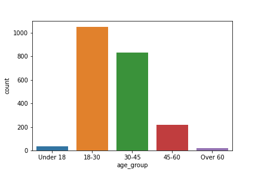
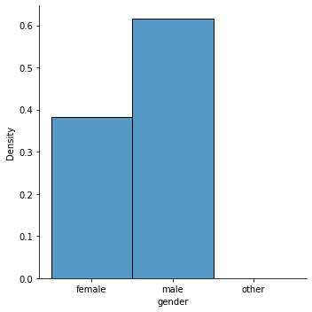

# A2: Bias in data

## Reproduce
You can reproduce the same result by running the code in this [Colab](https://colab.research.google.com/drive/1DzmKJGbbcoyH9Y00PLddIVx0R2DtIA9k?usp=sharing).
This Colab link includes code for downloading data, analysis, and discussions for the implications. The Colab notebook has exactly the same code as the notebook (`a2/hcds-a2-data-bias.ipynb`) in this repository

## Data
I have used [Wikipedia Talk corpus](https://figshare.com/projects/Wikipedia_Talk/16731) for the analysis.
The relevant Toxicity, aggression, and personal attacks datasets are available in following links.
- [Toxicity](https://figshare.com/articles/dataset/Wikipedia_Talk_Labels_Toxicity/4563973)
- [Aggression](https://figshare.com/articles/dataset/Wikipedia_Talk_Labels_Aggression/4267550)
- [Personal Attacks](https://figshare.com/articles/dataset/Wikipedia_Talk_Labels_Personal_Attacks/4054689)

Among these three, I have used Aggression and Personal Attacks for this assignment.
In case these links are unavailable, the download datasets are included in `a2/data` directory.

## Summary of Analysis

Here are some plots for the distribution analysis on Personal Attacks data

We found that there might be potential bias in the distribution of demographics within the workers who labeled the Wikipedia Talk corpus with Personal Attacks.

In addition, we found that some demographics have tendency to label Aggression score with more negetive score than other demographics.

## Plots
Code for generating plots is included in the notebook (`a2/hcds-a2-data-bias.ipynb`).
In addition, the generated plots are saved as `.png` file in this directory.

## References
- [Wikimedia Detox project wiki](https://meta.wikimedia.org/wiki/Research:Detox)
- [Overview of Google's Conversational AI project](https://conversationai.github.io/)
- [Perspective AI](https://www.perspectiveapi.com/#/home)
